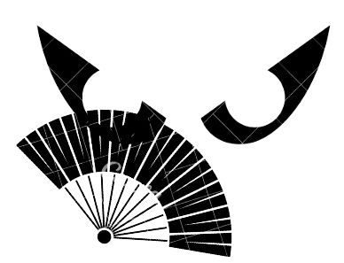

# Robô Kitana - Projeto Robocop

 

## Descrição do Projeto

O **Robô Kitana** é um projeto desenvolvido pela equipe Kombatentes do curso de Sistemas de Informação da FIAP. Este robô foi criado para participar de competições de batalha entre robôs. O Kitana Robot é baseado na plataforma Arduino e possui um leque como arma, que é utilizado para alcançar e estourar a bexiga do oponente.

## Características do Robô

- **Mobilidade:** Equipado com dois motores com redução para Arduino e rodas de borracha, proporcionando excelente mobilidade.
- **Energia:** Alimentado por um pack de baterias com capacidade para 8 pilhas tipo AA.
- **Arma:** Uma haste com um mini leque na ponta com agulhas nas pontas das hastes, garantindo maior alcance para acertar os balões adversários.

## Site do Projeto

Para mais detalhes sobre o projeto, visite nosso [site do Robô Kitana](#).

## Documentação

Toda a documentação do projeto está disponível na plataforma GitHub. A documentação inclui detalhes técnicos, esquemas de montagem, código-fonte e muito mais.

- [Documentação do Projeto](#)

## Estrutura do Projeto

### Estrutura de Pastas

- `img/`: Contém todas as imagens utilizadas no projeto.
- `css/`: Arquivos de estilo CSS.
- `js/`: Arquivos JavaScript.
- `docs/`: Documentação do projeto.
- `view/`: Pasta que contém o arquivo principal do site do projeto.

## Como Contribuir

Contribuições são bem-vindas! Sinta-se à vontade para abrir issues para reportar bugs ou sugerir melhorias. Pull requests também são bem-vindos.

## Licença

Este projeto está licenciado sob a Licença MIT. Veja o arquivo [LICENSE](LICENSE) para mais detalhes.

## Contato
Para dúvidas ou mais informações, entre em contato com a equipe:
- Email: [grazitds5@gmail.com](mailto:grazitds5@gmail.com)
- GitHub: [GrazielyTavares](https://github.com/GrazielyTavares)

Para dúvidas ou mais informações, entre em contato com a equipe:
- Email: [seuemail@example.com](mailto:seuemail@example.com)
- GitHub: [seuusuario](https://github.com/seuusuario)
